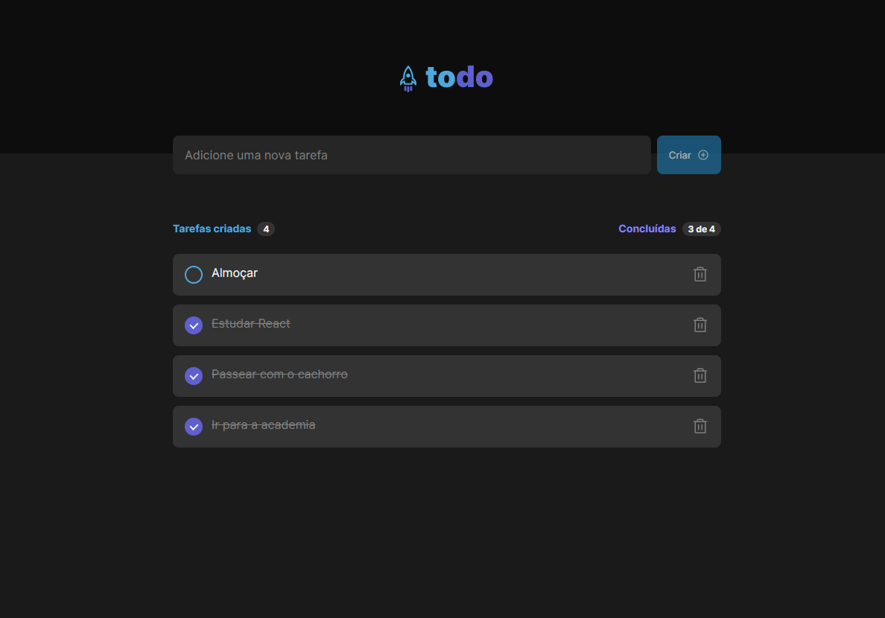

# Feed (React)

Essa aplicação foi desenvolvida como desafio durante a trilha de formação React da Rocketseat

## Executando

Após clonar o repositório, acesse a pasta do projeto e execute os comandos abaixo:

```sh
npm install
npm run dev
```

Acesse http://localhost:5173 para visualizar a aplicação.